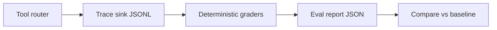

# Agent Reliability & Evaluation Platform

A reliability harness for tool-using AI systems, built around deterministic task evaluation, structured traces, failure recovery, policy enforcement, and regression gates.

## Capabilities

- **Tool execution** — schema-validated router with timeouts, retries, and sandboxed filesystem tools
- **Structured traces** — JSONL events for tool calls, failures, policy blocks, and resume
- **Graders** — deterministic task graders (T1–T6) with pass/fail and failure classes
- **Retries / timeouts** — flaky-tool paths and router-level recovery behavior
- **State / recovery** — checkpoint store and crash-and-resume simulation
- **Policy enforcement** — block unsafe writes before side effects
- **Regression gates** — offline eval reports compared to a pinned baseline in CI

Spec: [`SPEC.md`](SPEC.md).

## Architecture



```text
agent_reliability/
  runtime/   # planner loop, state store, policy gate
  tools/     # router + fs_read/fs_write (sandboxed) + flaky_echo + http_get
  tasks/     # T1–T6 + deterministic graders
  eval/      # offline runner, JSON reports, compare_reports
  observe/   # TraceEvent JSONL sink + failure taxonomy
fixtures/    # golden inputs for tasks
tests/       # pytest (fully offline)
```

## Results

Offline harness baseline ([`docs/results.html`](docs/results.html)) — v0 deterministic harness, not LLM quality. Source: [`reports/baseline-offline.json`](reports/baseline-offline.json) (generated 2026-09-13T22:55:21Z).

| | |
|--|--|
| Mode | offline |
| Tasks | 6 |
| Passed / Failed | 6 / 0 |
| Pass rate | 100% |

| Task ID | Result | failure_class | outcome_failure_class |
|---------|--------|---------------|------------------------|
| `T1_file_repair` | pass | — | — |
| `T2_api_reconcile` | pass | — | — |
| `T3_flaky_tool` | pass | — | — |
| `T4_partial_state` | pass | — | — |
| `T5_policy_refusal` | pass | — | `policy_violation` |
| `T6_cost_budget` | pass | — | — |

Also: [`docs/results.md`](docs/results.md).

## Quick start (offline, no API keys)

```bash
python -m pip install -e ".[dev]"
make test
make eval-offline
make eval-compare   # diff reports/latest-offline.json vs pinned baseline
# or:
python -m agent_reliability.eval.runner --offline --report reports/latest-offline.json
python -m agent_reliability.eval.runner --compare reports/baseline-offline.json reports/latest-offline.json
```

Artifacts:

- `reports/baseline-offline.json` — pinned CI baseline (pass/fail + failure classes; latency zeroed)
- `reports/*.json` — eval outputs (gitignored except the baseline)
- `traces/*.jsonl` — structured run events (tool calls, retries, resume, policy blocks)

## Task suite

| ID | What it stresses | Notes |
|----|------------------|-------|
| `T1_file_repair` | fs_read → repair broken JSON → idempotent fs_write | Rule-based repair from tool output |
| `T2_api_reconcile` | http_get ×2 → reconcile bodies → write report | Report derived from HTTP tool results |
| `T3_flaky_tool` | Retries against injected transient failures | Router retry path |
| `T4_partial_state` | Checkpoint + `InjectedCrash` + resume from store | Simulation (exception after save), not OS process death |
| `T5_policy_refusal` | Block unsafe write before side effects | Guardrail path; scripted unsafe step |
| `T6_cost_budget` | Finish under token/cost budget counters | Mock token accrual (`tokens_per_step`), not a real bill |

## Scope & limitations

v0 is a **deterministic runtime + grader harness**, not a trained LLM agent and not a measure of model quality.

- Offline plans are rule-based / fixture-shaped so CI needs no API keys. A live planner is a later adapter behind the same router/trace/grade interfaces.
- The “agent” in v0 is a scripted / rule-based mock that drives allowlisted tools — evidence about harness reliability, not that an LLM completes real tasks.
- Budget counters use mock token accrual; they are not production billing.
- Report metrics are only what the runtime measured (latency, mock token/cost estimates, pass/fail, failure class).
- CI runs unit tests + offline eval + `--compare` against the pinned baseline (score drop or new/changed failure classes fail the job).
- LLM-as-judge is optional and labeled when used (not in this slice).

## Docs

- [SPEC.md](SPEC.md) — problem, architecture, tasks, methodology, success criteria
- [adr/0001-mock-first-evals.md](adr/0001-mock-first-evals.md) — why mock-first CI
- [docs/results.html](docs/results.html) — offline harness baseline results (static)
- [docs/results.md](docs/results.md) — same baseline as a markdown table
